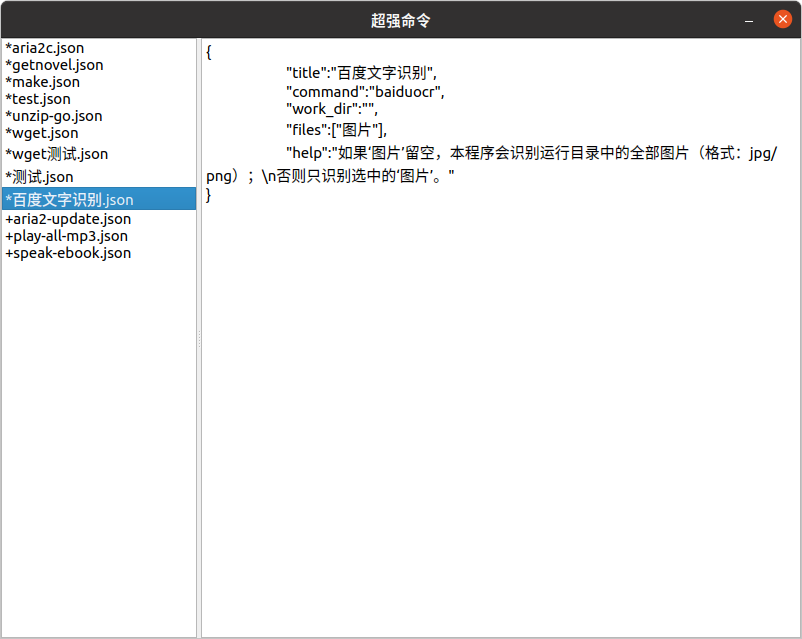

# 使用说明
使用json预先定义好命令行程序的一些参数，用图形界面方便的选择文件、目录或输入文本作为另一些参数。

## 配置文件(JSON)
用户必须把配置文件存放在`/opt/super-run_ubuntu_amd64/conf.d`目录中，其中已经有几个预先定义好的示例文件，可以参照修改为你需要的配置文件。

#### 第一段：预设内容
* title：窗口标题
	格式：string
* command：命令名字或者路径
	格式：string
* pre_args：预设参数
	格式：[string，string，...]
* envs：环境变量
	格式：[“name=value”，...]

#### 第二段：用户输入内容
- work_dir：运行目录，可预定义
	格式：dir:string
- opt_files：带选项的文件路径，预先定义参数名字和该参数的前缀选项
	格式：[[name:string,opt:string]，...]
- files：文件路径，预先定义名字
	格式：[path:string,...]
- opt_dirs：带选项的目录，预先定义参数名字和该参数的前缀选项
	格式：[[name:string,opt:string]，...]
- dirs：目录，预先定义名字
	格式：[dir:string,...]
- texts：文本参数，预先定义名字
	格式：[name:string, ...]

## 界面一：选择配置文件
显示配置文件列表，选择配置文件后显示配置文件内容谈，双击配置文件就显示`运行界面`。

## 界面二：运行界面
根据配置文件显示界面，下方有一个回显窗口显示运行后的输出信息，还有一个输入框可以输入文字信息。

